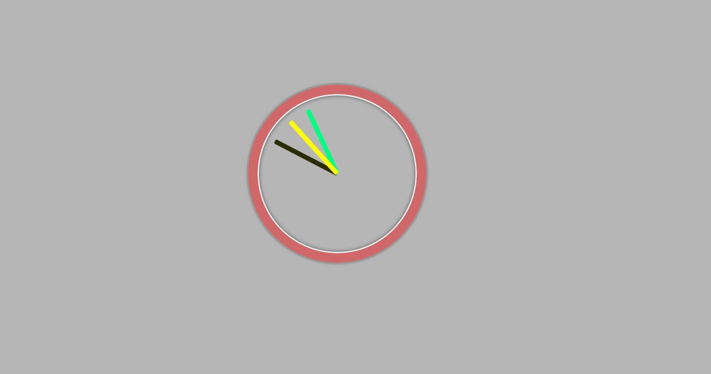

# Day2 - JS and CSS Clock [DEMO](https://ywcheng1207.github.io/JavaScript30/02%20-%20JS%20and%20CSS%20Clock/index-START.html)



<!-- CSS note-->
<details>
  <summary>CSS </summary>

1. 關於`transform-origin` 與 `transform: rotate()` <br>

   - `transform-origin`用於定義 CSS 的`transform`作用的起點。
   - 資料夾中我做了一份進一步的範例練習(`learn-transform-origin.html`)，可以觀察各種偏移的角度。 [DEMO](https://ywcheng1207.github.io/JavaScript30/02%20-%20JS%20and%20CSS%20Clock/learn-transform-origin.html)

2. 關於`transition-timing-function` <br>
   - `transition-timing-function`用於定義 CSS 的`transition`期間如何隨時間變化的時間函數。它控制`transition`效果的速度和節奏。 其中，有類型可以選擇，也可以透過`cubic-bezier()`自訂函式。範例就是透過`cubic-bezier()`達到指針在每次移動的時候有微小抖動的效果。

</details>

<!-- JS note-->
<details>
  <summary>JS </summary>

1. 關於`const now = new Date()` 與 `const seconds = now.getSeconds()` <br>

   - `Date()`物件用來指向某一個時間點。如果沒有參數的輸入，會回傳當下的時間。
   - 可以透過`getSeconds()`,`getMinutes()`,`getHours()`等方法獲取物件的各個值。

2. 關於`secondHand.style.transform` <br>

   - `secondHand.style.transform`的意思是修改`secondHande`節點的 CSS 屬性`transform`。

3. 關於`setInterval(setDate, 1000)`<br>

   - `setInterval()`的功能是指可以執行定期的任務或是動態的更新。
   - 主要的參數是`setInterval(callback,delay)`，就是要給定要執行什麼和延遲多少時間。
   - 如果第一個 callback 參數有其他需要輸入的參數，可以在後面添加，以下是一個簡單的範例：

```javascript
function greet(name, message) {
  console.log(`Hello, ${name}! ${message}`);
}

const yourName = "Alice";
const message = "How are you today?";

setInterval(greet, 2000, yourName, message);
```

</details>
