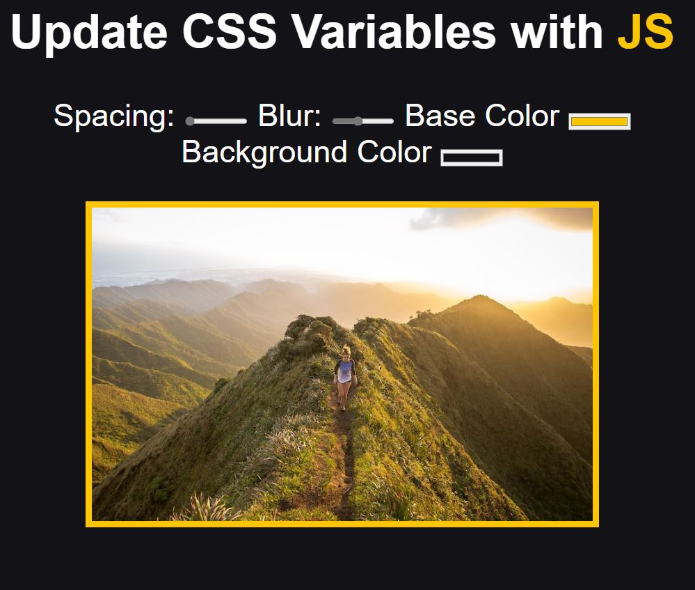

# Day3 - CSS Variables [DEMO](https://ywcheng1207.github.io/JavaScript30/03%20-%20CSS%20Variables/index-START.html)

## HTML

1. 關於`input`標籤  
   - `type="range"`：顯示一個水平的 slider，另可以設定 min, max 和 step。
   - `type="color"`：顯示一個 Color Picker。

## CSS

1. 關於在`:root`設定 CSS 變數  
   - 將變數定義在 root 的好處是方便全域使用、管理及修改。

## JS

1. 關於`mousemove`  
   - 若只有設定 change 事件監聽器，當 slider 滑動期間就不會觸發 handleUpdate
   - 也就是說，補上 mousemove 可以產生一邊滑動 slider、一邊看顏色變化的效果
2. 關於`document.documentElement.style.setProperty()`  
   - `document` 是指 html 文件，而 `document.documentElement` 是指 html 文件裡面的 html 節點
   - 若是用`event.target.style`可以找到該節點的`CSSStyleDeclaration`，但是由於範例是要改動一開始設定在 root 的 CSS 變數，所以需要使用`document.documentElement`。
