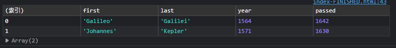

# Day4 - CSS Variables [DEMO](https://ywcheng1207.github.io/JavaScript30/04%20-%20Array%20Cardio%20Day%201/index-START.html)


## JS

1. 關於`console.table()` <br>

   - 以`Array.prototype.filter()`的輸出為例，可以把 array 裡面的物件轉換成表格形式，顯示在 console 中。
   - 橫排 row 的部分是 array 的 index，直排 column 是 array 的各個物件中的屬性。
     

2. 關於各種陣列操作，底下練習一些不同於作者範例的解法 (程式在 practice.js) <br>

   - Filter the list of inventors for those who were born in the 1500's<br>
     概念：reduce()也可以達到遍歷矩陣的效果，起始的 result 給予一個空陣列，在每次遍歷的過程中，只要符合條件就把內容 push 到 result 陣列中。<br>
     ```javascript
     const fifteen = inventors.reduce((result, inventor) => {
       if (inventor.year >= 1500 && inventor.year < 1600) {
         result.push(inventor);
       }
       return result;
     }, []);
     console.table(fifteen);
     ```
   - Give us an array of the inventor first and last names
     ```javascript
     const fullNames = [];
     for (const inventor of inventors) {
       const fullName = `${inventor.first} ${inventor.last}`;
       fullNames.push(fullName);
     }
     console.log(fullNames);
     ```
   - How many years did all the inventors live?
     ```javascript
     let totalYears = 0;
     inventors.forEach((inventor) => {
       totalYears += inventor.passed - inventor.year;
     });
     console.log(totalYears);
     ```
   - Sum up the instances of each of these<br>
     概念：透過 forEach 在每次遍歷的過程中，只要 transportation 物件裡面沒有當前項目的屬性，就會新增一個，並給予 0 的值，然後疊加一次當前項目的屬性的數量。<br>

     ```javascript
     const transportation = {};
     data.forEach((item) => {
       if (!transportation[item]) {
         transportation[item] = 0;
       }
       transportation[item]++;
     });
     console.log(transportation);
     ```

     而範例的作法如下：<br>
     概念：與上面的作法雷同，也是建立一個空的物件，然後在遍歷的過程中，只要 obj 裡面沒有當前項目的屬性，就會新增一個，並給予 0 的值，然後疊加一次當前項目的屬性的數量。最後回傳 obj 賦值予 transportation。

     ```javascript
     const transportation = data.reduce((obj, item) => {
       if (!obj[item]) {
         obj[item] = 0;
       }
       obj[item]++;
       return obj;
     }, {});
     console.log(transportation);
     ```
