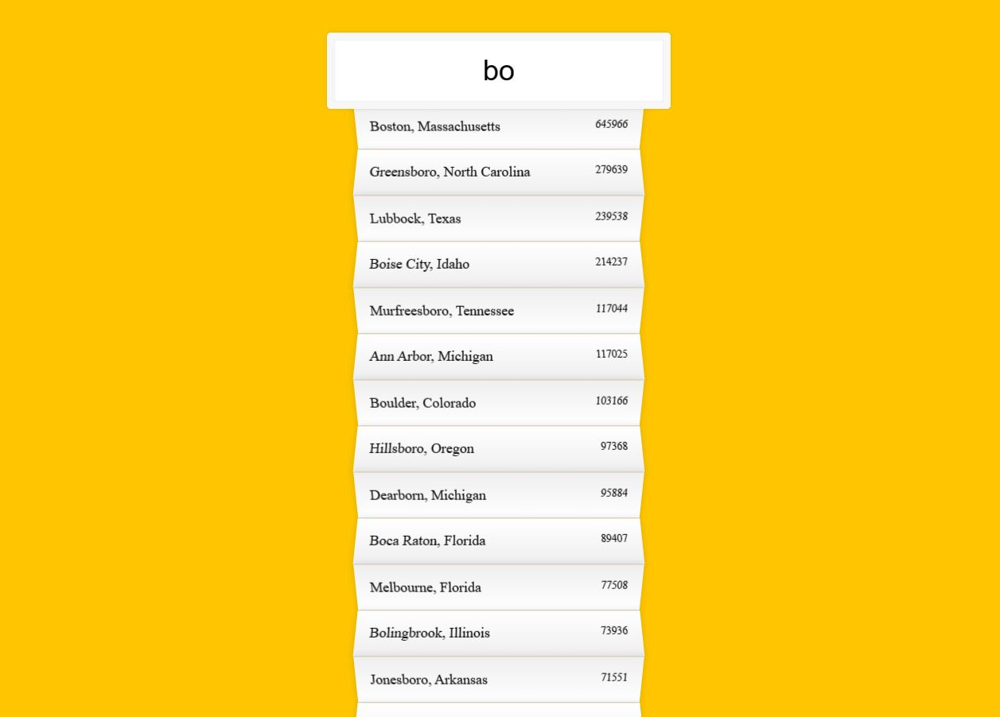

# Day6 - [DEMO](https://ywcheng1207.github.io/JavaScript30/06%20-%20Type%20Ahead/index-START.html)



## JS

- 關於資料串接 <br>
  範例使用的是 Fetch API 串接

  ```javascript
  const prom = fetch(endpoint) // 向endpoint這個url發出http的GET請求，並返回一個Promise物件
    .then((blob) => blob.json()) // 透過.json()解析前面GET請求收到的JSON
    .then((data) => cities.push(...data)); // 將放在陣列中的JSON資料展開，然後放進cities
  ```

  同樣的資料換成用 axios 練習串接

  ```javascript
  const axios = require("axios"); // 引入axios
  const url =
    "https://gist.githubusercontent.com/Miserlou/c5cd8364bf9b2420bb29/raw/2bf258763cdddd704f8ffd3ea9a3e81d25e2c6f6/cities.json";
  // GET請求

  axios
    .get(url) // 向url發出http的GET請求，並返回一個Promise物件
    .then((response) => response.data) // 透過.data取得前面GET請求收到的JSON
    .then((data) => console.log(data)); // 顯示資料
  ```

- 關於 Regular Expression<br>
  透過這個範例第一次接觸 Regular Expression，我在資料夾中的 learnRegExp.js 整理了一份，練習了一些基本操作供參考。

- 關於 `numberWithCommas`：<br>
  這個函數的作用是把一個數字轉換成一個帶有千分位逗號。<br>
  程式碼

  ```javascript
  function numberWithCommas(x) {
    return x.toString().replace(/\B(?=(\d{3})+(?!\d))/g, ",");
  }
  ```

  以下嘗試用文字解釋 Regular Expression 的內容：<br>

  - 先看包在外面的內容 🌠<br>

    - `/…/g`: 全局匹配，也就是 x 輸入進來的字串會全部檢查，而不是只找到一筆<br>
      `\B`: 就是指定不在空格、標點符號或字串開頭或結尾的位置<br>

  - 拆解裡面的內容 🌠<br>

    - `(?=(\d{3})+(?!\d))`: 表示查找連續出現的三位數，並且確保它們之後的字符不是數字。目的是定位數字中每三位數的位置，但排除了數字的開頭和結尾。<br>

      `(?=…)`: 可以理解為是否符合後面...的條件，這邊的...就是(\d{3})+(?!\d)<br>
      `(\d{3})+`: `\d`表示數字，`{3}`表示前面的\d 必須出現三次<br>
      `(?!\d))`: `\d`表示數字，`!\d`表示不是數字，`?!\d`表示要'確保'不是數字<br>
