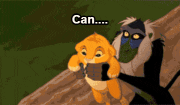

# Day8 - Fun with HTML5 Canvas [DEMO](https://ywcheng1207.github.io/JavaScript30/08%20-%20Fun%20with%20HTML5%20Canvas/index-START.html)



## JS

這篇主要介紹了 HTML 的 canvas 標籤，可以創造一個繪圖的空間，透過 JS 的操作來達到繪圖效果，底下依序整理一些基本流程：<br>

### step1. canvas 標籤，這個元素是一個繪圖區域<br>

`<canvas id="draw" width="800" height="800"></canvas>`<br>

### step2. JS 取得 canvas 的節點<br>

`const canvas = document.querySelector('#draw')`<br>

### step3. 透過 getContext 可以定義這個繪圖區域內的繪圖方法<br>

`const ctx = canvas.getContext('2d')`<br>

### step4. 2d 這個方法有許多屬性，底下這幾個就是範例<br>

`ctx.strokeStyle = '#BADA55'`<br>
`ctx.lineJoin = 'round'`<br>
`ctx.lineCap = 'round'`<br>
`ctx.lineWidth = 100`<br>

### step5. 定義 draw function<br>

```javascript
function draw(e) {
  if (!isDrawing) return
  // 透過改變hsl的參數，在mousemove的過程中改變顏色
  ctx.strokeStyle = `hsl(${hue},100%,50%)`
  // 每次執行draw都會開啟一個新的繪圖路徑
  ctx.beginPath()
  // 定義畫圖起始位置 (需釐清畫圖的起始位置與滑鼠點擊的落點不一定相同)
  ctx.moveTo(lastX, lastY)
  // 透過offset取得游標位置，表示他會從繪圖的起點畫線至游標的位置
  ctx.lineTo(e.offsetX, e.offsetY)
  // 前面都是在定義畫圖的方法，而stroke才是實際執行「畫圖」
  ctx.stroke()
  // 游標移動的過程，起點位置要跟著改變，不然就會一直從一開始的起點連線到當前游標的位置
  lastX = e.offsetX
  lastY = e.offsetY
  hue++
  // 超過hsl的參數最大值，就回到0
  if (hue >= 360) {
    hue = 0
  }
  // 讓畫筆逐漸放大縮小的設定
  // 這裡給一個direction狀態，當達到最大或最小值就會開始遞減或遞增
  if (ctx.lineWidth >= 100 || ctx.lineWidth <= 1) {
    direction = !direction
  }
  if (direction) {
    ctx.lineWidth++
  } else {
    ctx.lineWidth--
  }
}
```

### step6. EventListener 的設定<br>

mousemove => 游標移動時執行 draw<br>
mousedown => 按下滑鼠的當下，除了改變 isDrawing 的狀態為 true，還需要改變起點位置，不然圖形的第一筆會從一開始的(0,0)連線至游標位置<br>
mouseup => 改變 isDrawing 的狀態為 false<br>
mouseout => 當游標移出元素，中斷 drawing 的狀態
