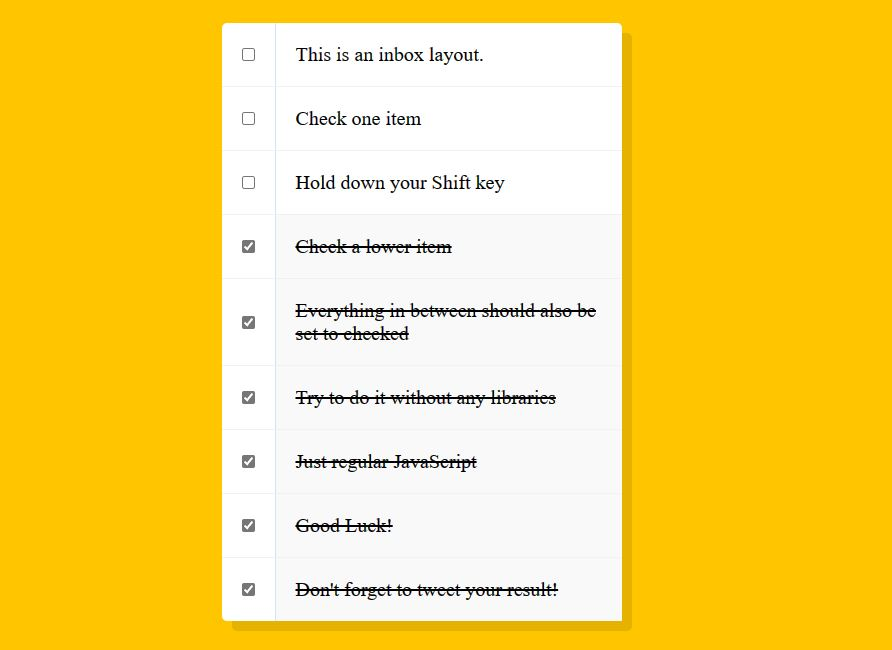

# Day9 - Hold Shift and Checkboxes [DEMO](https://ywcheng1207.github.io/JavaScript30/10%20-%20Hold%20Shift%20and%20Check%20Checkboxes/index-START.html)



## CSS

在範例中，左側的 checkboxes 的每一格都添加 border，排除 last-child 的設計

```CSS
  .item {
    display: flex;
    align-items: center;
    border-bottom: 1px solid #f1f1f1;
  }

  .item:last-child {
    border-bottom: 0;
  }
```

## JS

除了依循作者原先設計的函式，這裡練習用 arrow function 寫一次

```javascript
// 儲存上一次被選取的 checkbox
let lastChecked
const handleCheck = (e) => {
  let inBetween = false
  if (e.shiftKey && e.target.checked) {
    // 迭代所有的 checkboxes
    checkboxes.forEach((checkbox) => {
      console.log(checkbox)
      // 判斷目前的 checkbox 是否為目前被點擊的 checkbox 或上一次被選取的 checkbox
      if (checkbox === e.target || checkbox === lastChecked) {
        inBetween = !inBetween
        console.log('between!!!!!!!!!!!')
      }
      // 如果在兩個目標 checkbox 之間就勾選
      if (inBetween) {
        checkbox.checked = true
      }
    })
  }
  // 更新上一次被選取的 checkbox
  lastChecked = e.target
}
// 對每個 checkbox 加上點擊事件監聽器，並呼叫 handleCheck 函式
checkboxes.forEach((checkbox) => checkbox.addEventListener('click', handleCheck))
```

<br>
