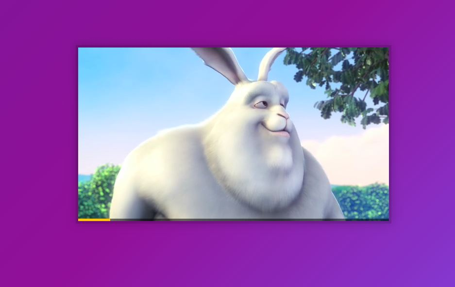

# Day11 - Custom Video Player [DEMO](https://ywcheng1207.github.io/JavaScript30/11%20-%20Custom%20Video%20Player/learn.html)



## CSS

1. 偽元素不包含在`*`，所以要另外設定

   ```CSS
   html {
     box-sizing: border-box;
   }

   *,
   *:before,
   *:after {
     box-sizing: inherit;
   }
   ```

2. 音量控制與播放速度調整的樣式
   2.1 WebKit 針對例如 Chrome、Safari 的瀏覽器

   - `::-webkit-slider-runnable-track`是指那條軌道
   - `::-webkit-slider-thumb`是軌道上的圓圈

   ```css
   input[type='range']::-webkit-slider-runnable-track {
   }
   input[type='range']::-webkit-slider-thumb {
   }
   ```

   2.2 Mozilla 針對例如 Firefox 瀏覽器

   - `::-moz-range-track`是指那條軌道
   - `::-moz-range-thumb`是軌道上的圓圈

   ```css
   input[type='range']::-moz-range-track {
   }

   input[type='range']::-moz-range-thumb {
   }
   ```

## JS

1.  實作細節<br>
    1.1 play 與 pause<br>

    - 分別透過`togglePlay()`與 `updateButton()`切換按鈕的功能及符號。
    - 設監聽器在 vedio 節點，分別監聽`click`, `play` 與 `pause` 事件<br>
      => 其中的 click 可以實現點擊影片的畫面而不是按鈕也能 play 與 pause
    - 設監聽器在 toggle 節點，監聽`click`

    ```javascript
    function togglePlay() {
      const method = video.paused ? 'play' : 'pause'
      video[method]()
    }
    function updateButton() {
      const icon = this.paused ? '►' : '❚ ❚'
      console.log(icon)
      toggle.textContent = icon
    }
    video.addEventListener('click', togglePlay)
    video.addEventListener('play', updateButton)
    video.addEventListener('pause', updateButton)
    toggle.addEventListener('click', togglePlay)
    ```

    1.2 skip<br>

    - 在 HTML 的`button`設定`data-skip`，可以用透過 dataset 經由 querySelector 取得節點。
    - 在`skip()`函式經由 `video.currentTime` 取得當前影片播放的時間進度，然後透過`parseFloat(this.dataset.skip)`將設定在 HTML 的`data-skip`的值轉成 float 並累加在`currentTime`。

    ```javascript
    function skip() {
      video.currentTime += parseFloat(this.dataset.skip)
      console.log(parseFloat(this.dataset.skip))
    }
    skipButtons.forEach((button) => button.addEventListener('click', skip))
    ```

    1.3 progress<br>

    - 透過`handleProgress()`設定`progressBar`的`flexBasis`來改變進度條，其中輸入的參數 percent 是經由`video.currentTime`與`video.duration`計算出來的撥放進度。
    - 透過`scrub()`函式實現拖曳進度條的功能，其中的`e.offsetX` 與 `progress.offsetWidth`分別是「滑鼠事件在進度條上的水平位置」、「進度條的寬度」。透過前面兩項除以`video.duration`得到 scrubTime，並賦值予 `video.currentTime`。
    - 在 progress 設置監聽器，分別監聽`click`,`mousemove`,`mousedown`與`mouseup`事件。建立一個狀態變數`mousedown`，並於 mousedown 與 mouseup 切換狀態。在 click 與 mousemove 的過程觸發`scrub()`以改變 `video.currentTime`。

    ```javascript
    function scrub(e) {
      const scrubTime = (e.offsetX / progress.offsetWidth) * video.duration
      video.currentTime = scrubTime
    }
    let mousedown = false
    progress.addEventListener('click', scrub)
    progress.addEventListener('mousemove', (e) => mousedown && scrub(e))
    progress.addEventListener('mousedown', () => (mousedown = true))
    progress.addEventListener('mouseup', () => (mousedown = false))
    ```

2.  其他<br>
    2.1 提升可讀性的技巧<br>
    (1) 作者想切換按鈕的功能，分別是`video.play`和`video.pause`，
    預先用 method 變數把條件處理好，才一起放進`video[method]`。(同樣的方式也呈現在`updateButton`)

    ```javascript
    function togglePlay() {
      const method = video.paused ? 'play' : 'pause'
      video[method]()
    }
    ```

    (2) 這邊有一個簡潔的寫法，因為有兩個 type 為 range 的 input，都需要使用 handleRangeUpdate，而且都需要監聽 change 與 mousemove。除了 JS 這邊的設定以外，記得要在 HTML 的 input 標籤添加 name 屬性。

    ```javascript
    function handleRangeUpdate() {
      video[this.name] = this.value
    }

    ranges.forEach((range) => range.addEventListener('change', handleRangeUpdate))
    ranges.forEach((range) => range.addEventListener('mousemove', handleRangeUpdate))
    ```

    2.2 整理這份作品使用的 video 的功能<br>
    `video.play`<br>
    `video.pause`<br>
    `video.currentTime`<br>
    `video.duration`<br>
