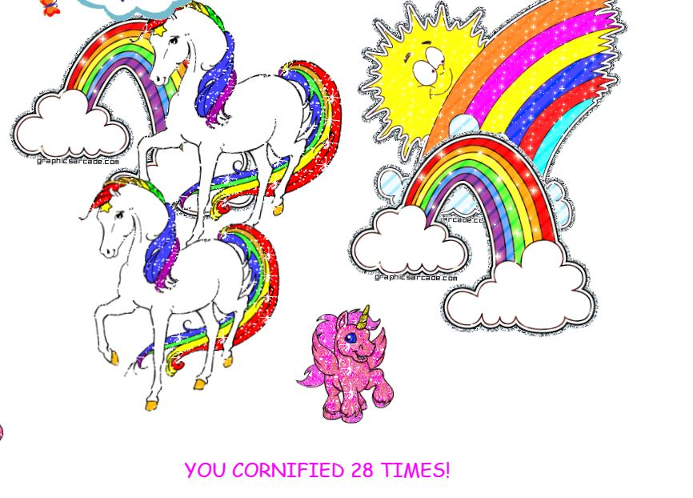

# Day12 - Key Sequence Detection [DEMO]()



## JS

說明如下

```javascript
      const pressed = []
      const secretCode = 'wesbos'
      window.addEventListener('keyup', (e) => {
        // 每次keyup都console.log是哪個key
        console.log(e.key)
        // 每次keyup就把key放進pressed陣列
        pressed.push(e.key)
        // 這裡想實作監聽user按了那些案件，只要連續出現的按鍵符合secretCode，就執行對應的動作
        // 所以從陣列的最後往前取得資料
        pressed.splice(-secretCode.length - 1, pressed.length - secretCode.length)
        // 透過join把陣列的值併起來變成字串，並確認是否符合secretCode
        if (pressed.join('').includes(secretCode)) {
          console.log('DING DING!')
          cornify_add()
        }
        console.log(pressed)
      }
```
